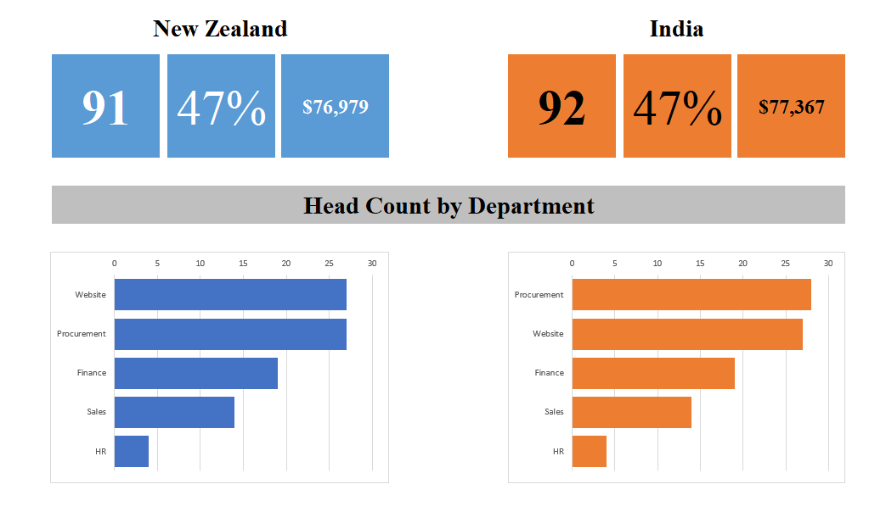

# Excel-employee-analysis
Mini Excel data analysis project 
# 📊 Employee Data Analysis Project (Excel)

## 📌 Overview

This project demonstrates end-to-end data analysis using Microsoft Excel, including data cleaning, transformation, analysis, and visualization. The project focuses on extracting meaningful insights from employee data such as salary trends, performance ratings, and workforce distribution.

---

## 🎯 Project Workflow

* Data Cleaning and Preparation
* Ad-hoc Data Analysis
* Data Transformation using Power Query
* Business Question Analysis
* Data Summarization and Statistics
* Lookup-based Information Finder (v1 & v2)
* Pivot Table Analysis
* Data Visualization
* Final Report Generation

---

## 🛠️ Tools & Technologies

* Microsoft Excel
* Power Query

---

## 📊 Key Analysis Performed

* Cleaned and formatted raw data
* Combined datasets using Power Query
* Answered business-related questions
* Built an **Information Finder tool** using lookup formulas
* Compared Male vs Female employees using Pivot Tables
* Calculated bonus based on business rules
* Analyzed salary distribution using histograms and box plots
* Studied correlation between salary and performance rating
* Tracked employee trends over time
* Created a final report comparing India vs New Zealand

---

## 📐 Excel Functions Used

* **XLOOKUP** – advanced lookup
* **VLOOKUP** – data retrieval
* **IF** – conditional logic
* **COUNTIF / SUMIF** – conditional aggregation
* **AVERAGE** – statistical calculation

---

## 📈 Key Insights

* Higher salary is generally associated with better performance ratings
* Gender distribution provides workforce composition insights
* Bonus varies based on defined performance rules
* Employee trends show hiring patterns over time

---

## 📁 Project Structure

* **Raw Data** – original dataset
* **Data Analysis** – cleaned and processed data
* **Pivot Analysis** – gender and comparison insights
* **Final Report** – summary and scorecard

---

## 📸 Screenshots

(Add your project screenshots here)

Example:

---

## 🚀 Purpose

This project was created to practice real-world data analysis using Excel and to understand how business insights can be derived from raw data.

---

## 🔮 Future Improvements

* Build interactive dashboard
* Add slicers and filters
* Improve visualization for better storytelling

---
